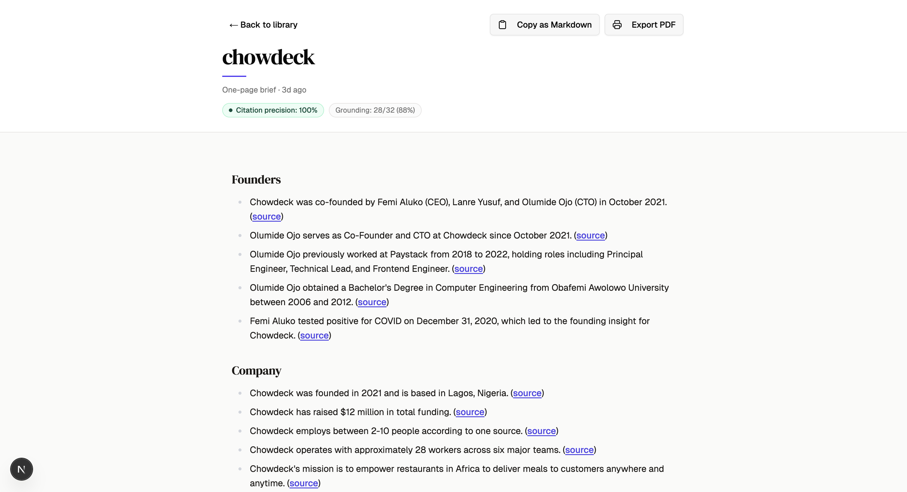
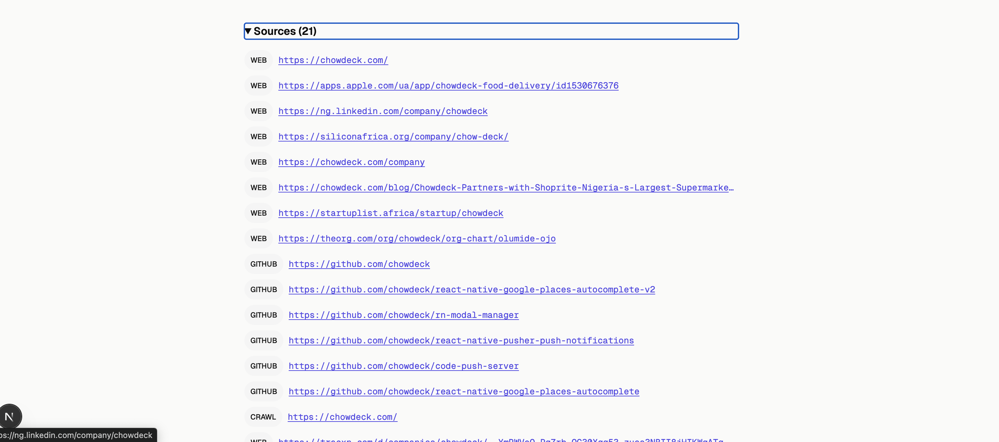
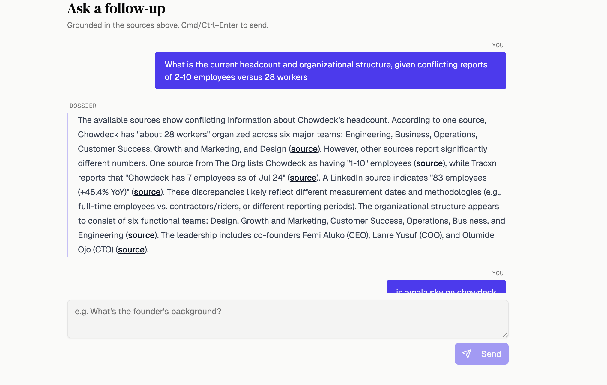

# Dossier

**An AI investigation agent for VC first-meeting prep.**

Drop a company name, URL, or pitch deck → get a one-page cited brief in 2–4 minutes. Every factual claim links back to the exact sentence it came from. After the brief loads, a grounded chat pane lets you ask follow-up questions that stay cited to the same corpus.

**Live demo → https://main.d30fatxfdws6s9.amplifyapp.com** · [Sample exported brief (PDF)](docs/Dossier.pdf)

Backend on AWS Lambda, frontend on AWS Amplify.

---

## Screenshots

**Cited brief** — every claim links to a verbatim source span


**Source panel** — 27 sources gathered across Exa, GitHub, Firecrawl, NewsAPI, Crunchbase


**Grounded chat** — follow-up answers stay cited to the same corpus


---

## The problem it solves

Seed-stage VC partners spend 30–60 minutes Googling before every first meeting — pulling founder backgrounds, funding history, product positioning, and news. The output is a patchwork of browser tabs with no citations you can trust after the fact.

Dossier compresses that research into a structured one-pager where **every claim is anchored to a verbatim source span**. The brief can't contain a claim it can't prove. If the grounder can't find a matching substring in the source corpus, the claim is dropped rather than cited with a hallucinated URL.

---

## Eval numbers

Run it yourself: `cd backend && uv run python -m dossier.eval.report`

| Company | Claims | Grounded | Grounding rate | Precision (grounded) |
|---|---|---|---|---|
| paidhr | 34 | 28 | 82.4% | 100.0% |
| Uber (deck) | 23 | 20 | 87.0% | 100.0% |
| Buffer (deck) | 27 | 27 | 100.0% | 100.0% |
| chowdeck | 32 | 28 | 87.5% | 100.0% |
| andela.com | 31 | 25 | 80.6% | 100.0% |
| x.com | 30 | 30 | 100.0% | 100.0% |
| facebook | 35 | 19 | 54.3% | 100.0% |
| linear | 22 | 17 | 77.3% | 100.0% |
| **Aggregate** | **234** | **194** | **82.9%** | **100.0%** |

**How to read this:** the synthesizer proposes ~30 claims per investigation. The grounder accepts ~83% on average. Of the accepted set, every quoted span is byte-identical to a substring of the cited source chunk. "Drop rather than fabricate" is the design posture.

---

## Under the hood

Most "cited AI" tools hallucinate the citation and hope you don't check. Dossier is built so you can check — and it'll pass.

**Citations are verified before they leave the system.** The synthesizer outputs each claim with a `quoted_span` — the exact text it's sourcing from. Before anything reaches the database, `ground.py` runs a normalized substring match against the raw source chunk. If the span isn't in there, the claim is dropped. Not flagged, not softened — dropped. That's why precision is 100%: the only claims that make it through are the ones that can be proven.

**The eval harness exists so this isn't just a claim.** Eight companies, scored deterministically from the database with a CLI tool (`dossier.eval.report`). No LLM judge scoring vibes — just byte-level substring matches counted up. You can run it yourself in 30 seconds.

**The graph self-corrects.** After the synthesizer drafts the brief, a verifier node checks section coverage and citation density. If anything is thin, it routes back to the planner with a list of targeted gaps — not a full re-run, just a second gather pass for the weak spots. The loop is capped at 2 reflections so cost stays bounded. The result is a brief that's harder to poke holes in without running 4 minutes of compute to find out.

---

## Architecture

```
Browser (Next.js 16 + Clerk)
    │  polling / chat
    ▼
AWS Lambda (single container — FastAPI via Mangum)
    │
    ├── POST /investigations  →  insert row + self-invoke Lambda with {investigation_id}
    │
    └── {investigation_id} event  →  LangGraph runner
            │
            ├── planner             (Haiku: pick gather angles + targeted_sections)
            ├── gather_fanout       (concurrent: Exa × 3, GitHub, Firecrawl, NewsAPI, Crunchbase)
            ├── founder_extraction  (Haiku: extract names → Send per-founder GitHub lookup)
            ├── ingest_and_embed    (chunk + embed + Haiku injection classifier → pgvector)
            ├── verifier            (Haiku: coverage check → reflect or continue, cap 2)
            ├── synthesizer         (Sonnet: draft 30 claims with quoted_spans)
            └── finalize            (ground.py: substring-match filter → persist to RDS)
                                     └── AsyncPostgresSaver checkpoint (RDS Postgres)

Models:       Claude Sonnet 4.5 (synthesis) + Claude Haiku 4.5 (planner/verifier/classifier)
Routing:      OpenRouter via stock openai SDK (base_url override)
Embeddings:   text-embedding-3-small via OpenAI direct
Observability: Langfuse — per-node spans, token counts, latency
```

---

## Tech stack

| Layer | Choice | Why |
|---|---|---|
| LLM routing | OpenRouter via stock `openai` SDK (`base_url` override) | Swap model with one env var; no per-provider SDK |
| Agent framework | LangGraph 1.0 | Resumable checkpoints via `AsyncPostgresSaver`; `Send` for concurrent fan-out |
| Models | Claude Sonnet 4.5 (synthesis) + Haiku 4.5 (planning/classification) | Cost/quality split — Haiku for structured extraction, Sonnet for prose |
| Backend | FastAPI + Mangum on AWS Lambda (container image) | Single deploy unit; container needed for `poppler-utils` (PDF → text) |
| Database | RDS Postgres + pgvector (HNSW index) | RAG retrieval + LangGraph checkpoint storage in one DB |
| Search | Exa (primary) | Returns full source URLs + markdown; Tavily hides source spans so citations would be unverifiable |
| Crawl | Firecrawl | Clean markdown from arbitrary URLs |
| Observability | Langfuse 3.x | Per-node spans, token counts, latency — critical for a multi-node graph |
| Frontend | Next.js 16 App Router + Clerk + TanStack Query | Auth + status polling without SSE infrastructure |
| Infra | Terraform (ECR + Lambda Function URL + RDS) | Single flat stack, no API Gateway overhead |

Full rationale for every choice, plus the rejected alternatives: **[DECISIONS.md](./DECISIONS.md)**

---

## Key files

| File | What it does |
|---|---|
| [`backend/src/dossier/investigate/graph/graph.py`](./backend/src/dossier/investigate/graph/graph.py) | LangGraph topology — nodes, edges, Send fan-out, reflection routing |
| [`backend/src/dossier/investigate/ground.py`](./backend/src/dossier/investigate/ground.py) | The "citations don't lie" mechanism — normalized substring match |
| [`backend/src/dossier/eval/scorer.py`](./backend/src/dossier/eval/scorer.py) | Deterministic `citation_precision()` — no LLM judge |
| [`backend/src/dossier/investigate/graph/nodes/synthesizer.py`](./backend/src/dossier/investigate/graph/nodes/synthesizer.py) | Sonnet call that produces `BriefSchema` claims with `quoted_span` |
| [`backend/src/dossier/investigate/graph/nodes/gather_fanout.py`](./backend/src/dossier/investigate/graph/nodes/gather_fanout.py) | Concurrent tool calls via `asyncio.gather` inside a LangGraph node |
| [`backend/src/dossier/investigate/graph/nodes/ingest_and_embed.py`](./backend/src/dossier/investigate/graph/nodes/ingest_and_embed.py) | Chunk + embed + Haiku injection classifier |
| [`backend/src/dossier/core/llm.py`](./backend/src/dossier/core/llm.py) | `structured_call` wrapper — retry on transient OpenRouter errors |
| [`backend/lambda_handler.py`](./backend/lambda_handler.py) | Lambda entry point — dispatches on event shape |
| [`DECISIONS.md`](./DECISIONS.md) | 15 architectural choices with rejected alternatives |

---

## Running locally

**Prerequisites:** Python 3.12+, [uv](https://docs.astral.sh/uv/), Docker, pnpm

```bash
# Backend
cp backend/.env.example backend/.env
# Fill in: OPENROUTER_API_KEY, OPENAI_API_KEY, EXA_API_KEY, GITHUB_TOKEN,
#          FIRECRAWL_API_KEY, NEWSAPI_API_KEY, LANGFUSE_PUBLIC_KEY, LANGFUSE_SECRET_KEY

docker compose up -d          # local Postgres with pgvector

cd backend
uv sync
uv run alembic upgrade head
uv run uvicorn dossier.api.main:app --reload --port 8000

# Frontend (separate terminal)
cd frontend
pnpm install
# Set NEXT_PUBLIC_BACKEND_URL=http://localhost:8000 in frontend/.env.local
pnpm dev
```

```bash
# Tests
cd backend && uv run pytest -q                     # 180 unit tests, no network
cd backend && uv run pytest tests/integration -q   # requires live DB

# Eval
cd backend && uv run python -m dossier.eval.report
cd backend && uv run python -m dossier.eval.report --json   # machine-readable
```

---

## Deploying to AWS

```bash
# First time
cd infra/terraform
terraform init
terraform apply -target=aws_ecr_repository.backend   # ECR must exist before push

cd ../..
make push     # docker build --platform linux/amd64 + ecr push
make deploy   # push + terraform apply with image URI
make migrate  # alembic upgrade head against RDS

# Subsequent deploys
make deploy
make logs     # tail CloudWatch live
```

Required secrets (set in `infra/terraform/terraform.tfvars`):
`OPENROUTER_API_KEY` · `OPENAI_API_KEY` · `EXA_API_KEY` · `GITHUB_TOKEN` · `FIRECRAWL_API_KEY` · `NEWSAPI_API_KEY` · `LANGFUSE_PUBLIC_KEY` · `LANGFUSE_SECRET_KEY` · `CLERK_JWKS_URL` · `DOSSIER_DISPATCH_MODE=lambda`

---

## Repo layout

```
├── backend/
│   ├── src/dossier/
│   │   ├── api/              FastAPI routes, schemas, Clerk JWT middleware
│   │   ├── core/             settings, DB engine, LLM helpers, exceptions
│   │   ├── eval/             eval harness: seed, scorer, report CLI
│   │   └── investigate/
│   │       ├── graph/        LangGraph state, nodes, runner, graph topology
│   │       ├── tools/        Exa, GitHub, Firecrawl, NewsAPI, Crunchbase clients
│   │       ├── ground.py     substring-match citation verifier
│   │       ├── ingest.py     chunk + embed pipeline
│   │       ├── synthesize.py Sonnet brief synthesis
│   │       └── chat.py       grounded chat turn handler
│   ├── tests/
│   │   ├── unit/             ~180 tests, no network required
│   │   └── integration/      live DB required
│   ├── lambda_handler.py     Lambda entry point (event-shape dispatch)
│   └── Dockerfile            Lambda container image (includes poppler-utils)
├── frontend/
│   └── src/app/              Next.js 16 App Router pages + components
├── infra/terraform/          Single-stack AWS (ECR + Lambda + RDS + Amplify)
├── DECISIONS.md              15 architectural choices with rejected alternatives
└── Makefile                  build / push / deploy / migrate / logs
```
